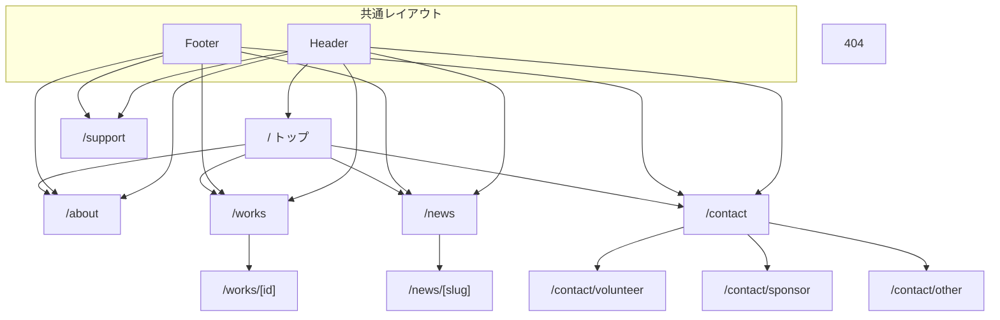

# Unitry 公式サイト 設計書

**対象:** 本リポジトリにおける実装（Next.js App Router）  
**作成:** 2026年5月15日  
**関連:** [要件定義書](./requirements.md)

---

## 1. 概要

### 1.1 目的

本設計書は、Unitry 公式ウェブサイトの **基本設計**（画面遷移・インターフェース）および **詳細設計**（プログラム単位の仕様）を記述する。実装の保守・引き継ぎ・要件との対応確認に用いる。

### 1.2 技術スタック（実装ベース）


| 区分       | 採用技術                                                   |
| -------- | ------------------------------------------------------ |
| フレームワーク  | Next.js 16（App Router）                                 |
| UI       | React 19、TypeScript                                    |
| スタイル     | Tailwind CSS 4                                         |
| アニメーション  | Framer Motion                                          |
| ホスティング想定 | Vercel                                                 |
| ニュース本文   | Markdown（`gray-matter` + `remark` / `remark-html`）     |
| SEO      | Metadata API、`next-sitemap`                            |
| 解析       | Google Analytics 4（任意、`NEXT_PUBLIC_GA_MEASUREMENT_ID`） |


---

## 2. 基本設計

### 2.1 画面一覧と URL


| No  | 画面名          | URL                    | 備考                        |
| --- | ------------ | ---------------------- | ------------------------- |
| 1   | トップ          | `/`                    | ヒーロー、紹介、Works/News 抜粋、CTA |
| 2   | 団体について       | `/about`               | 理念・活動・メンバー                |
| 3   | 作品一覧         | `/works`               | サムネイル＋概要                  |
| 4   | 作品詳細         | `/works/[id]`          | YouTube 埋め込み、SSG          |
| 5   | ニュース一覧       | `/news`                | Markdown 由来の一覧            |
| 6   | ニュース詳細       | `/news/[slug]`         | HTML レンダリング、SSG           |
| 7   | お問い合わせ（種別選択） | `/contact`             | カードから種別別フォームへ遷移           |
| 8   | お問い合わせ（フォーム） | `/contact/volunteer` 等 | Google フォーム埋め込み           |
| 9   | ご支援          | `/support`             | CAMPFIRE 埋め込み（URL 設定時）    |
| 10  | 404          | 任意の不正 URL              | `not-found.tsx`           |


動的ルートの `[id]` / `[slug]` はビルド時に `generateStaticParams` により静的生成（SSG）。

---

### 2.2 画面遷移

全ページ共通で **ヘッダー・フッター** から主要画面へ遷移可能。クライアントサイド遷移（Next.js `Link`）を基本とする。




**お問い合わせ専用フロー**

1. `/contact` で種別カード（ボランティア / 協賛・協力 / その他）を表示
2. カード押下で `/contact/{type}` に遷移（`type` は `volunteer` | `sponsor` | `other`）
3. 各ページで環境変数に応じ Google フォームを iframe 表示、または未設定メッセージ

---

### 2.3 インターフェース設計（UI）

#### 2.3.1 全体レイアウト


| 領域   | 仕様                                                                               |
| ---- | -------------------------------------------------------------------------------- |
| ヘッダー | 画面上部固定（`fixed`）、半透明ダーク背景＋ぼかし。ロゴは **テキスト「Unitry」**（現状）。ナビは md 以上で横並び、未満はハンバーガーで開閉 |
| メイン  | `flex-1` でフッターまで伸長                                                               |
| フッター | ダーク背景。ブランド文、ページリンク、Instagram リンク                                                 |
| フォント | `layout.tsx` で Noto Sans JP を読み込み                                                |


#### 2.3.2 カラー・トーン（`globals.css` / Tailwind）


| 用途         | 想定                     |
| ---------- | ---------------------- |
| アクセント      | 赤系（`primary`）          |
| ベース背景      | 白 / ライトグレー（セクションにより切替） |
| ヒーロー・ヘッダー帯 | ダーク                    |


#### 2.3.3 画面別 UI 要点


| 画面          | 主な UI 要素                                                                                                                 |
| ----------- | ------------------------------------------------------------------------------------------------------------------------ |
| トップ         | 全画面ヒーロー。背景はダーク＋グラデ（動画プレースホルダーあり）。`**HeroLogoBackdrop`** で鳥・文字 WebP を大きく重ね、上にタイトル・キャッチ・CTA ボタン。スクロールヒント。以降はセクション＋`FadeIn` |
| About       | ダーク帯タイトル、理念・活動・メンバーカード                                                                                                   |
| Works       | グリッドカード → 詳細へリンク                                                                                                         |
| Works 詳細    | YouTube iframe、説明テキスト                                                                                                    |
| News        | 一覧リストリンク                                                                                                                 |
| News 詳細     | フロントマター＋本文 HTML                                                                                                          |
| Contact トップ | 3 枚のカードリンク（ボタン風ホバー）                                                                                                      |
| Contact 種別  | 戻るリンク、見出し、`GoogleFormEmbed` またはプレースホルダー                                                                                  |
| Support     | 使いみちカード、CAMPFIRE iframe またはプレースホルダー、お問い合わせ誘導                                                                             |


#### 2.3.4 インタラクション


| 要素             | 挙動                                             |
| -------------- | ---------------------------------------------- |
| スクロール入場        | `FadeIn`（Framer Motion `whileInView`）でフェード＋微移動 |
| ヘッダーメニュー（モバイル） | 開閉アニメーション（`AnimatePresence`）                   |
| リンク・ボタン        | ホバーで色・背景変化（Tailwind）                           |


#### 2.3.5 アクセシビリティ方針

- 主要リンクに適切な文言、フォーム iframe に `title`  
- 装飾画像は `alt=""` と `aria-hidden`（ヒーローロックアップ）  
- ロゴリンク相当に `aria-label` を付与できる構成を推奨（ヘッダーはテキストリンクのため現状は不要）

---

### 2.4 外部インターフェース


| 接続先                | 用途             | 設定                              |
| ------------------ | -------------- | ------------------------------- |
| Google フォーム        | お問い合わせ（種別ごと）   | `NEXT_PUBLIC_GOOGLE_FORM_`*     |
| Google Analytics 4 | アクセス解析（任意）     | `NEXT_PUBLIC_GA_MEASUREMENT_ID` |
| CAMPFIRE           | ご支援ページ埋め込み（任意） | `NEXT_PUBLIC_CAMPFIRE_URL`      |
| YouTube            | 作品動画埋め込み       | `data/works.ts` の `youtubeId`   |
| Vercel             | ホスティング         | `SITE_URL`（sitemap 用）           |


---

## 3. 詳細設計（プログラム単位）

### 3.1 ソース構成（抜粋）

```
src/
├── app/
│   ├── layout.tsx          # ルートレイアウト、metadata、GA、Header/Footer
│   ├── page.tsx            # トップ
│   ├── globals.css
│   ├── not-found.tsx
│   ├── about/page.tsx
│   ├── works/page.tsx
│   ├── works/[id]/page.tsx
│   ├── news/page.tsx
│   ├── news/[slug]/page.tsx
│   ├── contact/page.tsx
│   ├── contact/[type]/page.tsx
│   └── support/page.tsx
├── components/
│   ├── Header.tsx          # client
│   ├── Footer.tsx
│   ├── FadeIn.tsx          # client
│   ├── SectionTitle.tsx
│   ├── HeroBrandTitle.tsx  # ヒーロー見出しのみ
│   ├── HeroLogoBackdrop.tsx# ヒーロー背後 WebP 二層
│   ├── GoogleFormEmbed.tsx
│   └── GoogleAnalytics.tsx # client
├── data/
│   ├── works.ts
│   ├── members.ts
│   └── hero-logo-lockup.ts # ヒーローロゴ寸法・不透明度・オフセット
└── lib/
    ├── markdown.ts         # ニュース取得・remark-html
    └── contact-forms.ts    # 問い合わせ種別・環境変数キー
content/news/*.md           # ニュース記事
public/images/               # 静止画・アセット
```

---

### 3.2 `app/layout.tsx`


| 項目       | 内容                                               |
| -------- | ------------------------------------------------ |
| 役割       | HTML `lang="ja"`、フォント、グローバル CSS、`metadata` 既定値   |
| 子要素      | `GoogleAnalytics` → `Header` → `main` → `Footer` |
| metadata | `title` テンプレート、`description`、OG の基本（`openGraph`） |


---

### 3.3 `app/page.tsx`（トップ）


| 項目       | 内容                                                                              |
| -------- | ------------------------------------------------------------------------------- |
| データ取得    | `works` の先頭 3 件、`getAllNews()` の先頭 3 件                                          |
| ヒーロー     | `relative` ラッパ内に `HeroLogoBackdrop` と `z-10` のコンテンツ列（`HeroBrandTitle`、キャッチ、ボタン） |
| その他セクション | Unitry 紹介、Works ハイライト、News、ボランティア CTA                                           |


---

### 3.4 `app/about/page.tsx`


| 項目  | 内容                                                   |
| --- | ---------------------------------------------------- |
| データ | `@/data/members` の配列をマップ                             |
| 構成  | ページヘッダー帯、理念・ミッション、価値カードグリッド、活動、「私たちの想い」ボックス、メンバーグリッド |


---

### 3.5 `app/works/page.tsx` / `app/works/[id]/page.tsx`


| ファイル                  | 内容                                                                                                      |
| --------------------- | ------------------------------------------------------------------------------------------------------- |
| `works/page.tsx`      | `works` 全件をグリッド表示、`Link` で `[id]` へ                                                                     |
| `works/[id]/page.tsx` | `generateStaticParams` / `generateMetadata`、`getWork(id)`。未存在は `notFound()`。YouTube `embed/{youtubeId}` |


---

### 3.6 `app/news/page.tsx` / `app/news/[slug]/page.tsx`


| ファイル                   | 内容                                                                                           |
| ---------------------- | -------------------------------------------------------------------------------------------- |
| `news/page.tsx`        | `getAllNews()` で一覧、日付・カテゴリ・タイトル・抜粋                                                           |
| `news/[slug]/page.tsx` | `getAllNewsSlugs` で SSG、`getNewsBySlug` で HTML 本文を `dangerouslySetInnerHTML`（remark-html 出力） |


---

### 3.7 `app/contact/page.tsx`


| 項目  | 内容                                                    |
| --- | ----------------------------------------------------- |
| 役割  | 種別説明＋3 カード。各 `Link` の `href` は `/contact/volunteer` 等 |
| メタ  | `metadata.title` 等                                    |


---

### 3.8 `app/contact/[type]/page.tsx`


| 項目                     | 内容                                                         |
| ---------------------- | ---------------------------------------------------------- |
| パラメータ                  | `type`: `volunteer`                                        |
| `generateStaticParams` | 上記 3 種固定                                                   |
| `generateMetadata`     | 種別ごとのタイトル・説明                                               |
| 表示                     | `getFormEmbedUrl(type)` が真なら `GoogleFormEmbed`、偽なら設定案内テキスト |


---

### 3.9 `app/support/page.tsx`


| 項目   | 内容                                                        |
| ---- | --------------------------------------------------------- |
| 環境変数 | `NEXT_PUBLIC_CAMPFIRE_URL` があれば iframe、なければプレースホルダー＋外部リンク |
| その他  | 使いみちカード、`/contact` への CTA                                 |


---

### 3.10 `app/not-found.tsx`

404 用の静的メッセージとトップへのリンク。

---

### 3.11 コンポーネント仕様

#### `Header.tsx`（`"use client"`）


| 項目       | 内容                  |
| -------- | ------------------- |
| state    | `isOpen`：モバイルメニュー開閉 |
| navLinks | パスとラベルの配列をマップ       |
| スタイル     | 固定ヘッダー、ダーク半透明       |


#### `Footer.tsx`


| 項目  | 内容                                        |
| --- | ----------------------------------------- |
| 役割  | ブランドテキスト、ナビ、`Instagram` 外部リンク（URL は要差し替え） |


#### `FadeIn.tsx`（`"use client"`）


| props | `children`, `delay?`, `direction?`, `className?` |
| ----- | ------------------------------------------------ |
| 挙動    | `motion.div` の `whileInView` で入場アニメ              |


#### `SectionTitle.tsx`

| props | `title`, `subtitle?`, `light?`（ダーク帯用の文字色切替） |

#### `HeroBrandTitle.tsx`


| 項目  | 内容                         |
| --- | -------------------------- |
| 出力  | ヒーロー用 `h1`「Unitry」とシャドウクラス |


#### `HeroLogoBackdrop.tsx`


| 項目  | 内容                                                                                                      |
| --- | ------------------------------------------------------------------------------------------------------- |
| データ | `hero-logo-lockup.ts` の `widthCss`, `opacity`, `centerOffsetYPercent`, `bird`/`word` の transform        |
| 構造  | 親は `absolute` 中央配置。子 2 層で `unitry_logo_bird.webp` / `unitry_logo_word.webp` を `fill` + `object-contain` |
| 属性  | `pointer-events-none`, `aria-hidden`                                                                    |


#### `GoogleFormEmbed.tsx`


| props | `src`, `title`                           |
| ----- | ---------------------------------------- |
| 挙動    | URL に `embedded=true` を付与（既に含む場合は重複付与なし） |


#### `GoogleAnalytics.tsx`（`"use client"`）

| 条件 | `NEXT_PUBLIC_GA_MEASUREMENT_ID` が定義されているときのみ `Script` 挿入 |

---

### 3.12 `lib/markdown.ts`


| 関数                    | 仕様                                               |
| --------------------- | ------------------------------------------------ |
| `getAllNews()`        | `content/news` の `.md` を読み、フロントマターからメタ配列。日付降順ソート |
| `getNewsBySlug(slug)` | 1 ファイル読み込み、`remark().use(html)` で本文 HTML         |
| `getAllNewsSlugs()`   | SSG 用 slug 配列                                    |


---

### 3.13 `lib/contact-forms.ts`


| export                  | 仕様                                                             |
| ----------------------- | -------------------------------------------------------------- |
| `contactFormTypes`      | 定数タプル                                                          |
| `contactFormMeta`       | 各 type の title, description, envKey（表示用）                       |
| `getFormEmbedUrl(type)` | `switch` で `process.env.NEXT_PUBLIC_GOOGLE_FORM_*` を参照（動的キー回避） |
| `isContactFormType`     | 型ガード                                                           |


---

### 3.14 `data/works.ts`


| 項目            | 内容                                                                          |
| ------------- | --------------------------------------------------------------------------- |
| `Work` 型      | `id`, `title`, `description`, `youtubeId`, `thumbnail`, `year`, `category?` |
| `works`       | サンプル配列                                                                      |
| `getWork(id)` | `find`                                                                      |


---

### 3.15 `data/members.ts`


| 項目         | 内容                             |
| ---------- | ------------------------------ |
| `Member` 型 | `name`, `role`, `bio`, `image` |
| `members`  | サンプル配列（画像はプレースホルダー想定）          |


---

### 3.16 `data/hero-logo-lockup.ts`


| キー                     | 用途                                     |
| ---------------------- | -------------------------------------- |
| `widthCss`             | ロックアップ正方形の一辺（CSS 文字列、`clamp` 推奨）       |
| `opacity`              | 背後画像の不透明度                              |
| `centerOffsetYPercent` | ロックアップ全体の縦オフセット（`translate` 合成）        |
| `bird` / `word`        | 各レイヤーの `translateX/Y Percent`, `scale` |


---

### 3.17 ビルド・サイトマップ


| 項目              | 内容                                                      |
| --------------- | ------------------------------------------------------- |
| `npm run build` | `next build` 後に `next-sitemap` 実行                       |
| 設定              | `next-sitemap.config.js` の `siteUrl`（環境変数 `SITE_URL` 可） |


---

### 3.18 環境変数一覧（実装対応）


| 変数名                                 | 用途                          |
| ----------------------------------- | --------------------------- |
| `NEXT_PUBLIC_GOOGLE_FORM_VOLUNTEER` | ボランティア用フォーム URL             |
| `NEXT_PUBLIC_GOOGLE_FORM_SPONSOR`   | 協賛・協力用                      |
| `NEXT_PUBLIC_GOOGLE_FORM_OTHER`     | その他用                        |
| `NEXT_PUBLIC_GA_MEASUREMENT_ID`     | GA4                         |
| `NEXT_PUBLIC_CAMPFIRE_URL`          | CAMPFIRE 埋め込み               |
| `SITE_URL`                          | canonical / sitemap ベース URL |


`.env.local` に記載。テンプレートは `.env.local.example`。

---

## 4. 改訂履歴


| 日付         | 内容                  |
| ---------- | ------------------- |
| 2026-05-15 | 初版（実装ベースの基本設計・詳細設計） |


---

*要件の変更に合わせて本書と [requirements.md](./requirements.md) を同期すること。*